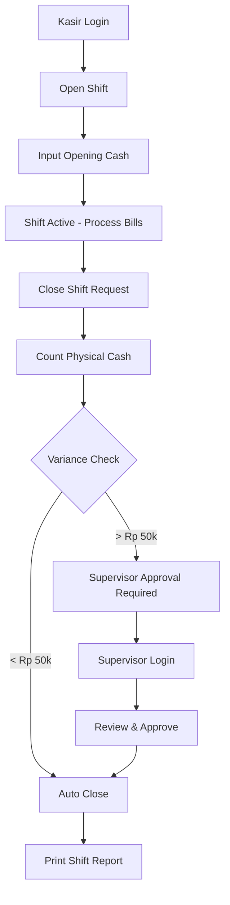
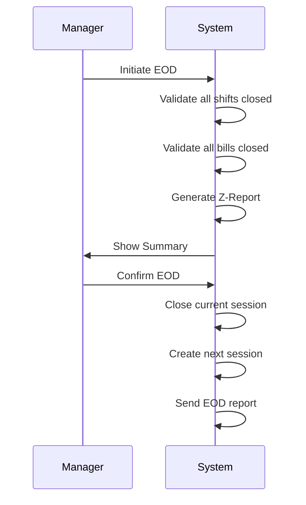

# EOD (End of Day) & Business Date Management

## Konsep Business Date

**Business Date ≠ Calendar Date**

Untuk bisnis F&B yang operasional melewati midnight (misal buka sampai jam 2 pagi), semua transaksi tetap dihitung sebagai 1 hari bisnis.

### Contoh Scenario:

```
Toko buka  : 10:00 (Jan 17)
Toko tutup : 02:00 (Jan 18)

Business Date untuk semua transaksi: January 17, 2026

Transaksi yang terjadi:
- 11:00 AM Jan 17 → Business Date: Jan 17 ✅
- 11:00 PM Jan 17 → Business Date: Jan 17 ✅
- 01:00 AM Jan 18 → Business Date: Jan 17 ✅ (Masih hari yang sama!)
- 01:30 AM Jan 18 → Business Date: Jan 17 ✅

Setelah EOD di jam 02:30 AM:
- Next bill → Business Date: Jan 18
```

### Keuntungan:

1. **Laporan Harian Konsisten** - Tidak split jadi 2 tanggal
2. **Shift Management Mudah** - Shift malam tidak confused
3. **Inventory Accurate** - Stock opname per business date
4. **Cashier Settlement** - Cash reconciliation per business day

---

## Store Session Management

### Store Session

Store Session = 1 Business Day

- **Opened**: Saat mulai operasional (biasanya pagi hari)
- **Closed**: Saat EOD (End of Day) process
- **is_current**: Flag untuk session aktif (hanya 1 per store)

### Business Rules:

1. **Only 1 Active Session** per store
2. **All Bills** inherit `business_date` from active session
3. **Cannot create bills** without active session
4. **EOD** closes current session dan create session baru

---

## Cashier Shift Management

### Shift Workflow:



### Shift Properties:

- **opening_cash**: Modal awal di cash drawer
- **expected_cash**: Calculated dari system (opening + cash payments)
- **actual_cash**: Counted fisik oleh kasir
- **cash_difference**: actual - expected

### Reconciliation by Payment Method:

Setiap shift close, kasir harus cocokkan **semua payment method**:

| Payment Method | Expected (System) | Actual (Counted) | Difference |
|---------------|-------------------|------------------|------------|
| Cash | Rp 2,500,000 | Rp 2,480,000 | -Rp 20,000 ⚠️ |
| Card | Rp 1,200,000 | Rp 1,200,000 | Rp 0 ✅ |
| QRIS | Rp 800,000 | Rp 800,000 | Rp 0 ✅ |
| E-Wallet | Rp 300,000 | Rp 300,000 | Rp 0 ✅ |

**Note**: Card/QRIS/E-Wallet di-cross check dengan settlement report dari provider.

---

## EOD (End of Day) Process

### EOD Checklist:

Sebelum EOD, system akan check:

- [ ] All bills closed or voided
- [ ] Kitchen no pending orders
- [ ] All cashier shifts closed
- [ ] Cash drawer counted
- [ ] Print Z-Report
- [ ] Backup database
- [ ] Lock safe

### EOD Workflow:



### EOD Validation:

**Blocking Issues** (Cannot proceed without force):
- Bills with status 'open'
- Cashier shifts still open
- Critical pending kitchen orders

**Warnings** (Can proceed):
- Bills with status 'hold'
- Incomplete checklist items
- Minor kitchen delays

---

## Lupa EOD Protection

### Alert Levels:

| Hours Since Open | Severity | Action |
|-----------------|----------|--------|
| < 12 hours | Info | Normal - no alert |
| 12-24 hours | Warning | Dashboard warning + reminder |
| > 24 hours | Critical | Transaction lock + SMS alert to manager |

### Force EOD Process:

Jika EOD > 24 jam:

1. **System locks new transactions**
2. **Manager receives SMS alert**
3. **Manager must login**
4. **Review open items**
5. **Force close open shifts** (if needed)
6. **Force void open bills** (with reason)
7. **Execute Force EOD** with supervisor approval
8. **System logs force EOD** for audit

### Force EOD Example:

```python
# Check EOD status
from apps.core.services_eod import EODService

status = EODService.check_eod_status(store)
# {'status': 'critical_overdue', 'can_transact': False, ...}

# Force EOD (requires supervisor)
if request.user.is_supervisor:
    next_session = EODService.execute_eod(
        session=current_session,
        closed_by=request.user,
        notes="Force EOD - forgot to close yesterday",
        force=True
    )
```

---

## Database Models

### StoreSession

```python
business_date      # Business date (not calendar date)
session_number     # Session sequence for day
opened_at          # Timestamp session opened
closed_at          # Timestamp EOD executed
status             # open, closed, force_closed
is_current         # Only 1 can be True per store
```

### CashierShift

```python
store_session_id   # Parent session
cashier_id         # Kasir
terminal_id        # Terminal used
shift_start        # Timestamp
shift_end          # Timestamp
opening_cash       # Starting cash
expected_cash      # System calculated
actual_cash        # Physical count
cash_difference    # Variance
status             # open, closed, abandoned
```

### ShiftPaymentSummary

```python
cashier_shift_id   # Parent shift
payment_method     # cash, card, qris, etc
expected_amount    # From system
actual_amount      # Physical/settlement
difference         # Variance
transaction_count  # Number of transactions
```

### BusinessDateAlert

```python
alert_type         # eod_overdue, shift_overtime, cash_variance
severity           # info, warning, critical
message            # Alert text
acknowledged       # Flag if seen
acknowledged_by    # Manager who saw it
```

---

## Management Commands

### Check EOD Overdue

Run as cron job every hour:

```bash
# Check dan create alerts
python manage.py check_eod_overdue

# Check dan send SMS notifications
python manage.py check_eod_overdue --notify
```

### Manual Session Start

```bash
python manage.py start_business_day --store=STORE001 --date=2026-01-17
```

---

## API Examples

### Open Cashier Shift

```python
from apps.core.services_eod import ShiftService

shift = ShiftService.open_shift(
    cashier=request.user,
    terminal=terminal,
    opening_cash=Decimal('500000')  # Rp 500,000
)
```

### Close Cashier Shift

```python
from apps.core.services_eod import ShiftService

result = ShiftService.close_shift(
    shift=current_shift,
    actual_amounts={
        'cash': Decimal('2480000'),     # Physical count
        'card': Decimal('1200000'),     # From settlement
        'qris': Decimal('800000'),      # From settlement
        'ewallet': Decimal('300000'),   # From settlement
    },
    closed_by=request.user,
    notes="Shift normal - slight cash shortage"
)

# Result:
# {
#     'cash_difference': Decimal('-20000'),  # Short Rp 20k
#     'requires_approval': False,             # < threshold
#     'payment_summaries': [...]
# }
```

### Execute EOD

```python
from apps.core.services_eod import EODService
from apps.core.models_session import StoreSession

current_session = StoreSession.get_current(store)

# Check readiness
validation = EODService.validate_eod_readiness(current_session)
# {'can_proceed': True, 'issues': [], 'warnings': ['2 held bills']}

# Create checklist
checklist = EODService.create_eod_checklist(current_session, request.user)

# Execute EOD
next_session = EODService.execute_eod(
    session=current_session,
    closed_by=request.user,
    notes="Normal EOD - all shifts balanced"
)

# Generate report
report = EODService.generate_eod_report(current_session)
```

---

## Frontend Integration

### Dashboard Warning

```html

<div class="alert alert-warning">
    ⚠️ EOD Overdue: {{ eod_status.hours_open|floatformat:1 }} hours
    <a href="">Close Day Now</a>
</div>



<div class="alert alert-danger">
    🚨 CRITICAL: EOD > 24 hours! Transactions locked.
    <a href="">Force EOD (Supervisor Only)</a>
</div>

```

### Shift Close Modal

```html
<div id="shift-close-modal">
    <h3>Close Shift - {{ shift.cashier.username }}</h3>
    
    <table>
        <tr>
            <th>Payment Method</th>
            <th>Expected (System)</th>
            <th>Actual (Count)</th>
            <th>Difference</th>
        </tr>
        <tr>
            <td>Cash</td>
            <td>Rp {{ shift.expected_cash|intcomma }}</td>
            <td><input type="number" name="actual_cash" step="1000"></td>
            <td id="cash-diff" class="text-danger"></td>
        </tr>
        <!-- More payment methods -->
    </table>
    
    <button onclick="closeShift()">Close Shift</button>
</div>
```

---

## Indexes untuk Performance

```sql
-- Session queries
CREATE INDEX idx_store_session_current ON store_session(store_id, is_current);
CREATE INDEX idx_store_session_business_date ON store_session(store_id, business_date);

-- Shift queries
CREATE INDEX idx_cashier_shift_session ON cashier_shift(store_session_id, cashier_id);
CREATE INDEX idx_cashier_shift_status ON cashier_shift(cashier_id, status);

-- Bill business date
CREATE INDEX idx_bill_business_date ON bill(business_date, outlet_id);

-- Alerts
CREATE INDEX idx_business_alert ON business_date_alert(store_id, acknowledged, severity);
```

---

## Security & Audit

**All EOD actions are logged:**

- Who opened session
- Who closed session
- Force EOD reasons
- Cash variance details
- Supervisor approvals
- System-generated alerts

**Access Control:**

- **Kasir**: Can open/close own shift
- **Supervisor**: Can approve variance, force close shifts
- **Manager**: Can execute EOD, force EOD
- **Admin**: Full access

---

## Best Practices

1. **Daily EOD Discipline** - Close day setiap hari, jangan lupa
2. **Cash Count Twice** - Count fisik 2x untuk akurasi
3. **Document Variance** - Tulis notes jika ada selisih
4. **Shift Overlap** - Beri waktu transisi antar shift
5. **Backup Before EOD** - Always backup database sebelum EOD
6. **Review Z-Report** - Manager review Z-Report sebelum approve EOD
7. **Alert Response** - Respond segera jika ada EOD overdue alert

---

**END OF DOCUMENT**
