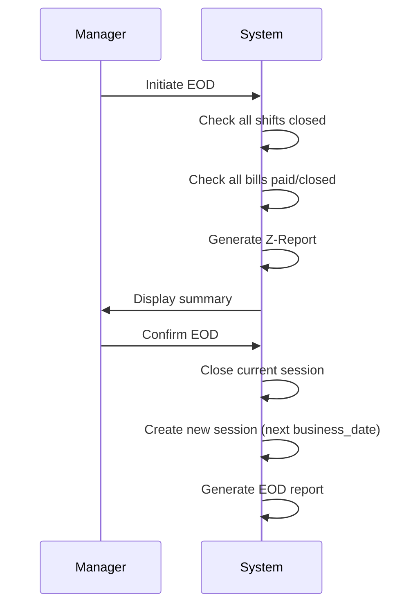
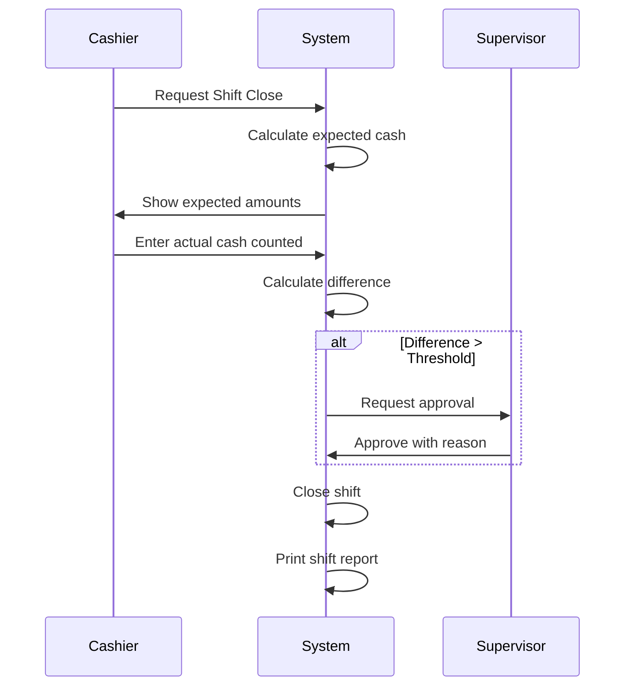

# ERD_EDGE_SERVER_POS_FNB.md

## 1. Purpose
Dokumen ini mendefinisikan **Entity Relationship Diagram (ERD)** untuk Edge Server
dalam arsitektur POS F&B Offline-LAN.

Edge Server berfungsi sebagai:
- Single source of truth di level store
- Orchestrator antara POS/Kiosk/Tablet ↔ HO Cloud
- Offline LAN-first operation

---

## 2. Core Principles
- Transactional data disimpan di Edge Server
- POS hanya cache session & UI state
- Semua order & payment harus lewat Edge API
- Promotion engine dieksekusi di Edge
- Multi-tenant: Company → Outlet → Store

---

## 3. Multi-Tenant Hierarchy

### company (Tenant Level)
| Field | Type | Description |
|------|------|-------------|
| id | UUID | Primary Key |
| code | varchar(20) | Unique company code |
| name | varchar(200) | Company name |
| logo | varchar | Logo URL |
| timezone | varchar(50) | Default timezone |
| is_active | boolean | Active status |
| created_at | timestamp | Created timestamp |
| updated_at | timestamp | Updated timestamp |

**Notes:**
- Top-level tenant isolation
- Semua data dibawahnya harus punya company_id
- Support multi-brand dalam 1 company

---

### outlet
| Field | Type | Description |
|------|------|-------------|
| id | UUID | Primary Key |
| company_id | FK → company | Parent company |
| code | varchar(20) | Unique outlet code |
| name | varchar(200) | Outlet/Brand name |
| address | text | Full address |
| phone | varchar(20) | Contact number |
| tax_id | varchar(50) | Tax ID (NPWP) |
| tax_rate | decimal(5,2) | Default tax % |
| service_charge | decimal(5,2) | Service charge % |
| receipt_footer | text | Receipt footer text |
| is_active | boolean | Active status |
| created_at | timestamp | Created timestamp |
| updated_at | timestamp | Updated timestamp |

**Notes:**
- 1 Company bisa punya banyak Outlet (brand/concept berbeda)
- Contoh: PT ABC punya outlet "Kopi Kenangan" dan "Kopi Tuku"
- Tax rate dan service charge di-set per outlet

---

### store
| Field | Type | Description |
|------|------|-------------|
| id | UUID | Primary Key |
| outlet_id | FK → outlet | Parent outlet |
| company_id | FK → company | Parent company (denormalized) |
| code | varchar(20) | Unique store code |
| name | varchar(200) | Store location name |
| address | text | Full address |
| phone | varchar(20) | Contact number |
| timezone | varchar(50) | Store timezone |
| latitude | decimal(10,8) | GPS latitude |
| longitude | decimal(11,8) | GPS longitude |
| is_active | boolean | Active status |
| created_at | timestamp | Created timestamp |
| updated_at | timestamp | Updated timestamp |

**Notes:**
- Lokasi fisik toko
- 1 Outlet bisa punya banyak Store (cabang)
- Contoh: Outlet "Kopi Kenangan" → Store "Senayan City", "Grand Indonesia"
- company_id disimpan untuk query optimization

---

### pos_terminal
| Field | Type | Description |
|------|------|-------------|
| id | UUID | Primary Key |
| store_id | FK → store | Parent store |
| terminal_code | varchar(20) | Unique terminal code |
| terminal_name | varchar(100) | Terminal display name |
| device_type | enum | pos, kiosk, tablet, kitchen_display |
| mac_address | varchar(17) | Hardware MAC address |
| ip_address | inet | Local IP address |
| is_active | boolean | Active status |
| last_heartbeat | timestamp | Last ping timestamp |
| last_sync | timestamp | Last sync timestamp |

**Notes:**
- Device fisik di store
- 1 Store bisa punya banyak terminal
- Heartbeat untuk monitoring online/offline status

---

### user_staff
| Field | Type | Description |
|------|------|-------------|
| id | UUID | Primary Key |
| company_id | FK → company | Parent company |
| store_id | FK → store | Assigned store (nullable) |
| username | varchar(50) | Login username |
| name | varchar(200) | Full name |
| role | enum | admin, manager, cashier, waiter, kitchen |
| pin_hash | varchar(255) | PIN code hash |
| is_active | boolean | Active status |
| created_at | timestamp | Created timestamp |

**Notes:**
- Tables per store
- QR code untuk table order feature
- Section untuk grouping (smoking/non-smoking, indoor/outdoor)

---

### table_merge
| Field | Type | Description |
|------|------|-------------|
| id | UUID | Primary Key |
| parent_table_id | FK → dining_table | Main table |
| child_table_id | FK → dining_table | Merged table |
| merged_at | timestamp | Merge timestamp |
| merged_by | FK → user_staff | Staff who merged |

**Notes:**
- Temporary merge untuk group dining
- Bill tetap di parent table
- Auto unmerge saat bill closed

---

## 5. Order & Billing

### bill
| Field | Type | Description |
|------|------|-------------|
| id | UUID | Primary Key |
| store_id | FK → store | Parent store |
| company_id | FK → company | Parent company (denormalized) |
| outlet_id | FK → outlet | Parent outlet (denormalized) |
| table_id | FK → dining_table | Assigned table (nullable) |
| bill_no | varchar(50) | Unique bill number |
| bill_type | enum | dine_in, takeaway, delivery |
| status | enum | open, hold, paid, cancelled, void |
| customer_name | varchar(200) | Customer name (optional) |
| customer_phone | varchar(20) | Customer phone (optional) |
| guest_count | int | Number of guests |
| queue_number | int | Queue number (for quick service) |
| business_date | date | Business date (from session) |
| cashier_shift_id | FK → cashier_shift | Shift when bill created |
| subtotal | decimal(12,2) | Total before discount/tax |
| discount_amount | decimal(12,2) | Total discount |
| tax_amount | decimal(12,2) | Tax amount |
| service_charge | decimal(12,2) | Service charge amount |
| total | decimal(12,2) | Grand total |
| notes | text | Bill notes |
| opened_by | FK → user_staff | Staff who opened |
| opened_at | timestamp | Open timestamp |
| closed_by | FK → user_staff | Staff who closed |
| closed_at | timestamp | Close timestamp |

**Notes:**
- company_id & outlet_id di-denormalize untuk reporting
- **business_date** berbeda dari calendar date - inherited from active session
- **cashier_shift_id** untuk tracking shift mana yang create bill
- Bill number format: {outlet_code}-{store_code}-{date}-{sequence}
- Status flow: open → hold (optional) → paid/cancelled/void
- Contoh: Bill created 01:30 AM (Jan 18) bisa punya business_date = Jan 17

**Indexes:**
```sql
CREATE INDEX idx_bill_business_date ON bill(business_date, outlet_id);
CREATE INDEX idx_bill_shift ON bill(cashier_shift_id);
```

---

### bill_item
| Field | Type | Description |
|------|------|-------------|
| id | UUID | Primary Key |
| bill_id | FK → bill | Parent bill |
| product_id | FK → product | Ordered product |
| quantity | int | Quantity ordered |
| unit_price | decimal(12,2) | Price per unit |
| modifier_price | decimal(12,2) | Additional modifier price |
| total | decimal(12,2) | Total (price * qty) |
| notes | text | Item notes/request |
| modifiers | json | Selected modifiers |
| status | enum | pending, sent, preparing, ready, served |
| is_void | boolean | Void flag |
| void_reason | text | Void reason |
| void_by | FK → user_staff | Staff who voided |
| created_by | FK → user_staff | Staff who created |
| created_at | timestamp | Created timestamp |

**Notes:**
- Item status untuk kitchen workflow
- Void item bisa pre/post kitchen
- Modifiers stored as JSON for flexibility

---

## 6. Product Master

### category
| Field | Type | Description |
|------|------|-------------|
| id | UUID | Primary Key |
| outlet_id | FK → outlet | Parent outlet |
| parent_id | FK → category | Parent category (nullable) |
| name | varchar(100) | Category name |
| icon | varchar(50) | Icon identifier |
| sort_order | int | Display order |
| is_active | boolean | Active status |

**Notes:**
- Hierarchical category (parent-child)
- Per outlet untuk flexibility
- Sort order untuk display di POS

---

### product
| Field | Type | Description |
|------|------|-------------|
| id | UUID | Primary Key |
| outlet_id | FK → outlet | Parent outlet |
| category_id | FK → category | Product category |
| sku | varchar(50) | Stock keeping unit |
| name | varchar(200) | Product name |
| description | text | Product description |
| price | decimal(12,2) | Selling price |
| cost | decimal(12,2) | Cost price |
| image | varchar | Image URL |
| printer_target | enum | kitchen, bar, dessert, none |
| track_stock | boolean | Enable stock tracking |
| stock_quantity | int | Current stock |
| low_stock_alert | int | Alert threshold |
| is_active | boolean | Active status |
| created_at | timestamp | Created timestamp |
| updated_at | timestamp | Updated timestamp |

**Notes:**
- printer_target untuk kitchen order routing
- Stock tracking optional (bar vs kitchen items)
- Bisa non-active tanpa delete (audit trail)

---

## 7. Promotion Engine

### promotion
| Field | Type | Description |
|------|------|-------------|
| id | UUID | Primary Key |
| outlet_id | FK → outlet | Applicable outlet |
| code | varchar(50) | Promo code |
| name | varchar(200) | Promo name |
| type | enum | discount_percent, discount_value, buy_x_get_y, bundle |
| discount_percent | decimal(5,2) | Discount % |
| discount_value | decimal(12,2) | Fixed discount value |
| min_purchase | decimal(12,2) | Min purchase requirement |
| max_discount | decimal(12,2) | Max discount cap |
| start_date | date | Start date |
| end_date | date | End date |
| start_time | time | Start time (daily) |
| end_time | time | End time (daily) |
| priority | int | Priority (higher = first) |
| stackable | boolean | Can stack with other promo |
| is_active | boolean | Active status |

**Notes:**
- Offline LAN execution
- Time-based activation
- Priority untuk conflict resolution

---

### promotion_rule
| Field | Type | Description |
|------|------|-------------|
| id | UUID | Primary Key |
| promotion_id | FK → promotion | Parent promotion |
| rule_type | enum | category, product, day_of_week, payment_method |
| condition_json | json | Rule conditions |
| action_json | json | Actions to apply |

**Notes:**
- Flexible rule engine via JSON
- Example: {"category_id": ["uuid1", "uuid2"], "min_qty": 2}
- Action: {"discount_percent": 20, "free_product_id": "uuid"}

---

### applied_promotion
| Field | Type | Description |
|------|------|-------------|
| id | UUID | Primary Key |
| bill_id | FK → bill | Applied to bill |
| promotion_id | FK → promotion | Promotion used |
| discount_value | decimal(12,2) | Actual discount given |
| applied_at | timestamp | Applied timestamp |

**Notes:**
- Audit trail promotion usage
- Untuk reporting dan analytics

---

## 8. Voucher

### voucher
| Field | Type | Description |
|------|------|-------------|
| id | UUID | Primary Key |
| outlet_id | FK → outlet | Applicable outlet |
| code | varchar(50) | Voucher code (unique) |
| name | varchar(200) | Voucher name |
| type | enum | value, percent |
| value | decimal(12,2) | Discount value |
| percent | decimal(5,2) | Discount percent |
| min_purchase | decimal(12,2) | Min purchase requirement |
| max_discount | decimal(12,2) | Max discount cap |
| usage_limit | int | Total usage limit |
| usage_count | int | Current usage count |
| per_user_limit | int | Limit per customer |
| start_date | date | Start date |
| expired_at | date | Expiry date |
| is_active | boolean | Active status |

**Notes:**
- Offline LAN validation
- Usage count increment saat redeem
- Sync to HO untuk global quota

---

### voucher_redeem
| Field | Type | Description |
|------|------|-------------|
| id | UUID | Primary Key |
| voucher_id | FK → voucher | Redeemed voucher |
| bill_id | FK → bill | Applied to bill |
| discount_value | decimal(12,2) | Actual discount |
| redeemed_by | FK → user_staff | Staff who applied |
| redeemed_at | timestamp | Redeem timestamp |

**Notes:**
- Audit trail voucher redemption
- Prevent double redemption

---

## 9. Payment

### payment
| Field | Type | Description |
|------|------|-------------|
| id | UUID | Primary Key |
| bill_id | FK → bill | Parent bill |
| method | enum | cash, card, qris, transfer, ewallet |
| amount | decimal(12,2) | Payment amount |
| reference | varchar(100) | Payment reference (EDC trace) |
| created_by | FK → user_staff | Staff who processed |
| created_at | timestamp | Payment timestamp |

**Notes:**
- Support multiple payment (split payment)
- Reference untuk EDC/QRIS reconciliation
- Sum of payments harus >= bill.total

---

## 10. Kitchen Display System

### kitchen_order
| Field | Type | Description |
|------|------|-------------|
| id | UUID | Primary Key |
| bill_id | FK → bill | Parent bill |
| station | enum | kitchen, bar, dessert |
| status | enum | pending, preparing, ready, served, cancelled |
| priority | int | Order priority |
| created_at | timestamp | Created timestamp |
| prepared_at | timestamp | When marked ready |

**Notes:**
- 1 bill bisa punya multiple kitchen orders (per station)
- UNIQUE constraint: (bill_id, station) - prevent duplicates
- Status sync dengan bill_item

---

### kitchen_order_item
| Field | Type | Description |
|------|------|-------------|
| id | UUID | Primary Key |
| kitchen_order_id | FK → kitchen_order | Parent order |
| bill_item_id | FK → bill_item | Reference item |
| product_name | varchar(200) | Product name snapshot |
| quantity | int | Quantity |
| notes | text | Special request |
| modifiers | json | Modifiers snapshot |
| status | enum | pending, preparing, ready, served |

**Notes:**
- Snapshot data untuk display (denormalized)
- Prevent kitchen confusion saat product renamed

---

## 11. Printer Configuration

### printer_config
| Field | Type | Description |
|------|------|-------------|
| id | UUID | Primary Key |
| store_id | FK → store | Parent store |
| station | enum | kitchen, bar, dessert, cashier |
| printer_name | varchar(100) | Printer name |
| printer_ip | inet | Network IP address |
| printer_type | enum | epson, star, bixolon |
| is_active | boolean | Active status |

**Notes:**
- Network printer config per station
- Offline LAN printing

---

## 12. Audit & Sync

### bill_log
| Field | Type | Description |
|------|------|-------------|
| id | UUID | Primary Key |
| bill_id | FK → bill | Related bill |
| action | enum | open, add_item, void, hold, resume, payment, close |
| details | json | Action details |
| user_id | FK → user_staff | Staff who did action |
| created_at | timestamp | Action timestamp |

**Notes:**
- Complete audit trail
- Details stored as JSON for flexibility
- user_id tracks which staff performed action

---

### sync_log
| Field | Type | Description |
|------|------|-------------|
| id | UUID | Primary Key |
| entity | varchar(50) | Entity type (bill, payment, etc) |
| entity_id | UUID | Entity ID |
| action | enum | insert, update, delete |
| payload | json | Data payload |
| synced | boolean | Sync status |
| synced_at | timestamp | Sync timestamp |
| retry_count | int | Retry attempts |
| error_message | text | Error if failed |
| created_at | timestamp | Log timestamp |

**Notes:**
- Queue untuk sync Edge → HO
- Retry mechanism untuk failed sync
- Payload stored untuk idempotency

---

## 13. Business Date & Store Session Management

### store_session
| Field | Type | Description |
|------|------|-------------|
| id | UUID | Primary Key |
| store_id | FK → store | Parent store |
| business_date | date | Business date (not calendar date) |
| session_number | int | Session number for the day |
| opened_at | timestamp | Session start timestamp |
| opened_by | FK → user_staff | Staff who opened session |
| closed_at | timestamp | Session end timestamp (EOD) |
| closed_by | FK → user_staff | Staff who closed session (EOD) |
| status | enum | open, closed, force_closed |
| is_current | boolean | Current active session flag |
| settings | json | Session settings/config |
| eod_notes | text | EOD notes/remarks |

**Unique Constraints:**
- (store_id, business_date, session_number)
- Only one session can have is_current=true per store

**Notes:**
- **Business Date** berbeda dari calendar date
- Contoh: Toko buka 10:00 (Jan 17) sampai 02:00 (Jan 18) = Business Date: Jan 17
- EOD process creates new business_date
- Session bisa multiple per day jika ada forced restart
- is_current flag untuk quick lookup active session

**Business Rules:**
- Session MUST be opened before any transaction
- All bills inherit business_date from active session
- EOD closes current session and creates next session
- Jika lupa EOD > 24 jam: system sends alert to manager
- Force EOD requires supervisor approval

---

### cashier_shift
| Field | Type | Description |
|------|------|-------------|
| id | UUID | Primary Key |
| store_session_id | FK → store_session | Parent session |
| cashier_id | FK → user_staff | Cashier on shift |
| terminal_id | FK → pos_terminal | Terminal used |
| shift_start | timestamp | Shift start time |
| shift_end | timestamp | Shift end time |
| status | enum | open, closed, abandoned |
| opening_cash | decimal(12,2) | Starting cash in drawer |
| expected_cash | decimal(12,2) | Expected cash at close |
| actual_cash | decimal(12,2) | Actual cash counted |
| cash_difference | decimal(12,2) | Difference (actual - expected) |
| closed_by | FK → user_staff | Supervisor who approved close |
| notes | text | Shift notes/remarks |

**Notes:**
- Tracks individual cashier shifts within business date
- Multiple shifts possible per cashier per day
- Cash reconciliation required at shift end
- Supervisor approval required jika difference > threshold
- abandoned status jika kasir tidak proper close

---

### shift_payment_summary
| Field | Type | Description |
|------|------|-------------|
| id | UUID | Primary Key |
| cashier_shift_id | FK → cashier_shift | Parent shift |
| payment_method | enum | cash, card, qris, transfer, ewallet |
| expected_amount | decimal(12,2) | Amount from system |
| actual_amount | decimal(12,2) | Amount counted/verified |
| difference | decimal(12,2) | Difference amount |
| transaction_count | int | Number of transactions |
| notes | text | Remarks for this method |

**Notes:**
- Breakdown per payment method
- Cashier must verify each payment type
- Card/QRIS: check settlement report vs system
- Cash: physical counting
- Difference tracking per method untuk audit

---

### eod_checklist
| Field | Type | Description |
|------|------|-------------|
| id | UUID | Primary Key |
| store_session_id | FK → store_session | Parent session |
| checklist_item | varchar(200) | Item to check |
| is_completed | boolean | Completion status |
| completed_by | FK → user_staff | Who completed |
| completed_at | timestamp | Completion time |
| notes | text | Additional notes |

**Notes:**
- EOD checklist items yang must be done
- Example items:
  - "Verify all bills closed"
  - "Check kitchen no pending orders"
  - "Count cash drawer"
  - "Print Z-Report"
  - "Backup database"
  - "Lock safe"

---

### business_date_alert
| Field | Type | Description |
|------|------|-------------|
| id | UUID | Primary Key |
| store_id | FK → store | Parent store |
| alert_type | enum | eod_overdue, shift_overtime, cash_variance |
| severity | enum | info, warning, critical |
| message | text | Alert message |
| data | json | Related data |
| acknowledged | boolean | Acknowledged flag |
| acknowledged_by | FK → user_staff | Who acknowledged |
| acknowledged_at | timestamp | Acknowledgment time |
| created_at | timestamp | Alert creation time |

**Notes:**
- System-generated alerts untuk anomalies
- EOD overdue: > 24 jam belum EOD
- Shift overtime: shift > 12 jam belum close
- Cash variance: difference > threshold
- Manager must acknowledge critical alerts

---

**EOD Process Flow:**



**Lupa EOD Handling:**

1. **< 12 hours**: Warning reminder di dashboard
2. **12-24 hours**: Alert ke manager + SMS notification
3. **> 24 hours**: 
   - System locks new transactions
   - Force EOD required with supervisor approval
   - Auto-create backdated EOD with timestamp
   - Flag session as "force_closed"
   - Audit log for investigation

**Shift Close Process:**



**Example Queries:**

```python
# Get current business date
current_session = StoreSession.objects.get(store=store, is_current=True)
business_date = current_session.business_date

# Check if EOD overdue
from django.utils import timezone
hours_since_open = (timezone.now() - current_session.opened_at).total_seconds() / 3600
if hours_since_open > 24:
    # Send alert
    
# Get all bills for current business date
bills = Bill.objects.filter(business_date=business_date, outlet=outlet)

# Cash reconciliation for shift
shift = CashierShift.objects.get(id=shift_id)
shift.expected_cash = shift.get_expected_cash()  # From payments
shift.cash_difference = shift.actual_cash - shift.expected_cash
```

---

## 14. Cashier Reporting & User Tracking

**User Tracking Fields:**

All transactional tables track user activity for comprehensive reporting:

| Table | Tracked Fields | Purpose |
|-------|----------------|---------|
| **bill** | created_by, closed_by | Who opened/closed bill |
| **bill_item** | created_by, void_by | Who added/voided items |
| **payment** | created_by | Who processed payment |
| **bill_log** | user_id | Complete audit trail |
| **kitchen_order** | - | Inherited from bill |

**Database Indexes for Performance:**

```sql
-- Bill indexes for cashier reports
CREATE INDEX idx_bill_created_by_at ON bill(created_by, created_at);
CREATE INDEX idx_bill_closed_by_at ON bill(closed_by, closed_at);

-- BillItem indexes for item-level analysis
CREATE INDEX idx_billitem_created_by_at ON bill_item(created_by, created_at);

-- Payment indexes for cashier payment reports
CREATE INDEX idx_payment_created_by_at ON payment(created_by, created_at);
```

**Available Reports:**

1. **Cashier Shift Report:**
   - Bills opened/closed count
   - Total sales amount
   - Average bill value
   - Items added/voided
   - Payments processed (by method)
   - Period: configurable (default today)

2. **Terminal-Cashier Report:**
   - Which cashiers used which terminal
   - Bills created per cashier per terminal
   - Sales amount per cashier per terminal
   - Bill completion rate

3. **Multi-Cashier Summary:**
   - Performance comparison across cashiers
   - Ranking by total payments processed
   - Void rate per cashier
   - Bills per hour rate

**Example Queries:**

```python
# Get cashier shift report
from apps.pos.reports import get_cashier_summary
summary = get_cashier_summary(user=kasir, start_date=shift_start)

# Get all cashiers report for outlet
from apps.pos.reports import get_all_cashiers_summary
summaries = get_all_cashiers_summary(outlet=outlet, start_date=today)

# Get terminal usage by cashiers
from apps.pos.reports import get_terminal_cashier_report
report = get_terminal_cashier_report(terminal=pos_terminal, start_date=today)
```

**Related Name Conventions:**

```python
# User relationships
user.bills_created       # Bills opened by user
user.bills_closed        # Bills closed/paid by user
user.bill_items_created  # Items added by user
user.voided_items        # Items voided by user
user.payments_processed  # Payments handled by user

# Terminal relationships
terminal.bills           # Bills created on terminal
```

---

## 14. Data Ownership Summary

| Entity | HO (Master) | Edge (Cache) | Edge (Transactional) |
|--------|-------------|--------------|---------------------|
| company | ✅ | ✅ | ❌ |
| outlet | ✅ | ✅ | ❌ |
| store | ✅ | ✅ | ❌ |
| category | ✅ | ✅ | ❌ |
| product | ✅ | ✅ | ❌ |
| promotion | ✅ | ✅ | ❌ |
| voucher | ✅ | ✅ | ❌ |
| user_staff | ✅ | ✅ | ❌ |
| dining_table | ✅ | ✅ | ❌ |
| store_session | ❌ | ❌ | ✅ |
| cashier_shift | ❌ | ❌ | ✅ |
| bill | ❌ | ❌ | ✅ |
| bill_item | ❌ | ❌ | ✅ |
| payment | ❌ | ❌ | ✅ |
| kitchen_order | ❌ | ❌ | ✅ |
| bill_log | ❌ | ❌ | ✅ |
| shift_payment_summary | ❌ | ❌ | ✅ |
| eod_checklist | ❌ | ❌ | ✅ |

**Sync Direction:**
- HO → Edge: Master data (pull every N minutes)
- Edge → HO: Transactional data (push realtime/queue)

---

## 16. Multi-Tenant Data Isolation

**Query Pattern:**
```sql
-- Always filter by company_id
SELECT * FROM bill 
WHERE company_id = :tenant_company_id 
  AND store_id = :current_store_id;

-- Denormalized company_id/outlet_id untuk performance
-- Hindari multiple JOIN saat reporting
```

**Benefits:**
- Fast query dengan indexed company_id
- Clear data ownership
- Easy multi-brand support

---

## 17. Business Date vs Calendar Date

**Key Concept:**

Business Date ≠ Calendar Date untuk operasional yang melewati midnight.

**Example Scenario:**

```
Toko buka: 10:00 AM (Jan 17)
Toko tutup: 02:00 AM (Jan 18)

Business Date: January 17, 2026

Bills created at:
- 11:00 AM Jan 17 → Business Date: Jan 17 ✅
- 11:00 PM Jan 17 → Business Date: Jan 17 ✅
- 01:00 AM Jan 18 → Business Date: Jan 17 ✅ (Still same business day!)
- 01:30 AM Jan 18 → Business Date: Jan 17 ✅

EOD Process at 02:30 AM Jan 18:
- Close session for Business Date Jan 17
- Create new session for Business Date Jan 18
- Next bills → Business Date: Jan 18
```

**Benefits:**
- Laporan harian jadi 1 tanggal, bukan split 2 tanggal
- Sales report konsisten dengan operasional shift
- Kasir tidak confused dengan tanggal ganti
- Inventory calculation lebih akurat

**Implementation:**
```python
# Bill always inherits business_date from active session
current_session = StoreSession.objects.get(store=store, is_current=True)
bill.business_date = current_session.business_date

# Query by business date (bukan created_at date)
daily_sales = Bill.objects.filter(
    business_date='2026-01-17',  # Business date
    outlet=outlet
).aggregate(Sum('total'))
```

---

## 18. EOD & Shift Management Summary

**Critical Business Rules:**

1. **Session Management:**
   - Only 1 active session per store (is_current=True)
   - All transactions must have active session
   - EOD closes current, creates next session
   - Cannot create bills without active session

2. **Shift Management:**
   - Kasir must open shift before transactions
   - Shift tied to specific terminal
   - Multiple shifts per kasir per day allowed
   - Shift close requires cash reconciliation

3. **Cash Reconciliation:**
   - Required at every shift close
   - Must count ALL payment methods (not just cash)
   - Variance > threshold needs supervisor approval
   - System tracks expected vs actual amounts

4. **Lupa EOD Protection:**
   - **< 12 hours:** Dashboard warning
   - **12-24 hours:** SMS alert ke manager
   - **> 24 hours:** Transaction lock + force EOD required
   - Force EOD requires supervisor login + reason
   - Audit log created for delayed EOD

5. **Supervisor Overrides:**
   - Cash variance > Rp 50,000
   - Force EOD (> 24 hours)
   - Shift close without reconciliation
   - Backdated EOD correction
   - All logged to audit trail

**Database Consistency Checks:**

```sql
-- Check: Only 1 active session per store
SELECT store_id, COUNT(*) 
FROM store_session 
WHERE is_current = true 
GROUP BY store_id 
HAVING COUNT(*) > 1;

-- Check: All open shifts have active session
SELECT cs.* 
FROM cashier_shift cs
LEFT JOIN store_session ss ON cs.store_session_id = ss.id
WHERE cs.status = 'open' 
  AND ss.status != 'open';

-- Check: All bills have business_date
SELECT COUNT(*) 
FROM bill 
WHERE business_date IS NULL;

-- Check: Overdue EOD (> 24 hours)
SELECT * 
FROM store_session 
WHERE is_current = true 
  AND opened_at < NOW() - INTERVAL '24 hours';
```

---

## 19. Implementation Files Created

**Models:**
- `apps/core/models_session.py` - StoreSession, CashierShift, ShiftPaymentSummary, EODChecklist, BusinessDateAlert

**Services:**
- `apps/core/services_eod.py` - EODService, ShiftService (EOD logic, validation, execution)

**Management Commands:**
- `apps/core/management/commands/check_eod_overdue.py` - Cron job untuk check EOD overdue

**Documentation:**
- `.instruction/EOD_BUSINESS_DATE_GUIDE.md` - Complete guide untuk EOD process

**Key Features:**
- ✅ Business date tracking (berbeda dari calendar date)
- ✅ Store session management (1 session = 1 business day)
- ✅ Cashier shift dengan cash reconciliation
- ✅ Payment method breakdown per shift
- ✅ EOD checklist & validation
- ✅ Lupa EOD protection (warning → critical → lock)
- ✅ Force EOD dengan supervisor approval
- ✅ Cash variance detection & alerts
- ✅ Audit trail lengkap

---

**END OF ERD**
- Semua PK menggunakan UUID
- JSON digunakan untuk rule flexibility
- Business Date untuk konsistensi laporan harian
- EOD mandatory sebelum next business day
- Cash reconciliation mandatory per shift close
- HO hanya menerima finalized data
- Edge dapat replay sync saat online kembali

---

**Related Documentation:**
- See `EOD_BUSINESS_DATE_GUIDE.md` for detailed EOD process
- See `ARCHITECTURE.md` for system overview
- See `SETUP_GUIDE.md` for installation

---

END OF DOCUMENT
