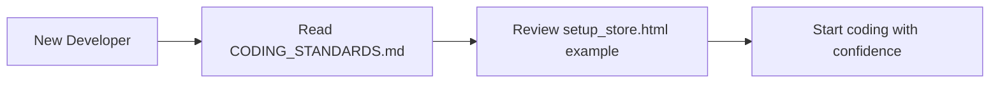
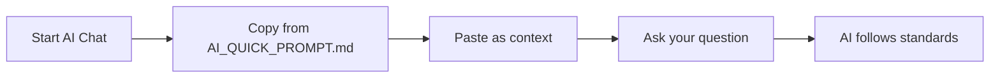

# 📚 Documentation Index

Dokumentasi lengkap untuk FoodLife POS System development.

---

## 📂 AVAILABLE DOCUMENTS

### **1. [CODING_STANDARDS.md](./CODING_STANDARDS.md)** 🎯
**For:** Developers (Human)  
**Purpose:** Complete coding guidelines, architecture patterns, and best practices  
**When to read:** 
- Starting to work on this project
- Before implementing new features
- Need design pattern examples
- Code review preparation

**Content:**
- Technology stack explanation
- Architecture principles
- Component patterns (Form, Modal, List)
- Do's and Don'ts with examples
- File structure guidelines
- Testing guidelines

**Size:** ~500 lines | **Time to read:** 20-30 minutes

---

### **2. [AI_PROMPT.md](./AI_PROMPT.md)** 🤖
**For:** AI Assistants (GitHub Copilot, Claude, GPT-4, etc.)  
**Purpose:** Instructions for AI to follow when generating code  
**When to use:** 
- Working with AI coding assistants
- Want AI to generate consistent code
- Need AI to understand project context

**Content:**
- Project context for AI
- Critical rules (offline-first, tech stack)
- Component templates
- Code review checklist
- Decision matrix
- Communication style guidelines

**Size:** ~400 lines | **Time to read:** 15-20 minutes

---

### **3. [AI_QUICK_PROMPT.md](./AI_QUICK_PROMPT.md)** ⚡
**For:** Quick AI prompting  
**Purpose:** Copy-paste prompt for starting conversations with AI  
**When to use:** 
- Start of every AI conversation
- Quick reminder for AI mid-conversation
- Need fast reference

**Content:**
- Short context prompt (copy-paste ready)
- How to use guide
- Quick reference table
- Troubleshooting tips

**Size:** ~100 lines | **Time to read:** 5 minutes

---

## 🚀 QUICK START GUIDE

### **For Human Developers:**

**Step 1:** Read [CODING_STANDARDS.md](./CODING_STANDARDS.md) (20-30 min)  
**Step 2:** Open `templates/core/setup_store.html` as reference  
**Step 3:** Follow component patterns when coding  

---

### **For AI-Assisted Development:**

**Step 1:** Copy prompt from [AI_QUICK_PROMPT.md](./AI_QUICK_PROMPT.md)  
**Step 2:** Paste at start of AI conversation  
**Step 3:** AI will follow project standards automatically  

---

## 🎯 WHICH DOCUMENT TO USE?

### **Scenario-Based Guide:**

| I want to... | Read This | Priority |
|-------------|-----------|----------|
| Learn project architecture | CODING_STANDARDS.md | 🔥 Must |
| Get component examples | CODING_STANDARDS.md | 🔥 Must |
| Work with AI assistant | AI_QUICK_PROMPT.md | ⚡ Quick |
| Configure AI deeply | AI_PROMPT.md | 📚 Deep |
| Quick pattern lookup | CODING_STANDARDS.md → Code Examples | ⚡ Quick |
| Understand Alpine.js usage | CODING_STANDARDS.md → Component Patterns | 🔥 Must |
| See working code | `templates/core/setup_store.html` | 💡 Example |

---

## 📖 READING ORDER

### **For New Team Members:**

1. **Day 1:** Read `CODING_STANDARDS.md` section 1-3 (1 hour)
   - Technology Stack
   - Architecture Principles
   - Component Patterns

2. **Day 2:** Study `templates/core/setup_store.html` (30 min)
   - See Alpine.js in action
   - Understand modal component
   - Learn API call patterns

3. **Day 3:** Read rest of `CODING_STANDARDS.md` (30 min)
   - Do's and Don'ts
   - File Structure
   - Testing Guidelines

4. **Day 4+:** Keep `AI_QUICK_PROMPT.md` bookmarked for daily AI use

---

### **For Experienced Developers (Already Know Alpine.js):**

1. Read `CODING_STANDARDS.md` → "Do's and Don'ts" section (10 min)
2. Skim `templates/core/setup_store.html` (5 min)
3. Bookmark `AI_QUICK_PROMPT.md` for AI assistance
4. Start coding! 🚀

---

## 🔍 DOCUMENT COMPARISON

| Feature | CODING_STANDARDS | AI_PROMPT | AI_QUICK_PROMPT |
|---------|------------------|-----------|-----------------|
| **Audience** | Humans | AI | Both |
| **Detail Level** | Comprehensive | Detailed | Summary |
| **Examples** | Many | Many | Few |
| **Usage** | Reference | AI Context | Quick Start |
| **Length** | 500 lines | 400 lines | 100 lines |
| **Read Time** | 30 min | 20 min | 5 min |
| **Update Frequency** | Monthly | Monthly | As needed |

---

## 💡 TIPS FOR SUCCESS

### **For Better Code Quality:**

1. ✅ Read standards BEFORE coding
2. ✅ Follow patterns consistently
3. ✅ Use AI with proper context (AI_QUICK_PROMPT.md)
4. ✅ Review setup_store.html as reference
5. ✅ Test offline (no internet connection)

### **For AI Assistance:**

1. ✅ Always start with context from AI_QUICK_PROMPT.md
2. ✅ Remind AI if it deviates from standards
3. ✅ Reference specific sections: "Follow pattern in CODING_STANDARDS.md section 3.1"
4. ✅ Ask for explanations: "Why Alpine.js instead of vanilla JS?"

---

## 🔄 DOCUMENT UPDATES

These documents are **living documents** and should be updated when:

- New patterns are discovered
- Technology stack changes
- Best practices evolve
- Common mistakes are identified

**Last Updated:** February 10, 2026  
**Next Review:** March 10, 2026  

---

## 📞 QUESTIONS?

If documentation is unclear or missing information:

1. Check `templates/core/setup_store.html` for working example
2. Search codebase for similar implementations
3. Ask team lead or senior developer
4. Propose documentation update via PR

---

## 🏆 SUCCESS METRICS

You know you've internalized the standards when:

- ✅ You write Alpine.js components without thinking
- ✅ You never use CDN links
- ✅ You include error handling automatically
- ✅ Your code matches existing patterns
- ✅ AI generates correct code with minimal prompting
- ✅ Code reviews have minimal feedback

---

## 📚 ADDITIONAL RESOURCES

### **External Documentation:**

- [Alpine.js Official Docs](https://alpinejs.dev/)
- [HTMX Documentation](https://htmx.org/)
- [Tailwind CSS Docs](https://tailwindcss.com/)
- [Django Best Practices](https://docs.djangoproject.com/)

### **Internal Files:**

- `templates/core/setup_store.html` - Working Alpine.js example
- `templates/pos/main.html` - POS interface with Alpine.js
- `static/js/` - JavaScript utilities and components

---

## 🎓 LEARNING PATH

### **Week 1: Foundations**
- [ ] Read CODING_STANDARDS.md completely
- [ ] Study setup_store.html line by line
- [ ] Practice writing simple Alpine.js component
- [ ] Test working offline

### **Week 2: Practice**
- [ ] Implement 1 new form using Alpine.js
- [ ] Refactor 1 old vanilla JS file to Alpine.js
- [ ] Create 1 reusable component
- [ ] Write tests for your components

### **Week 3: Mastery**
- [ ] Help review team member's code
- [ ] Suggest improvement to standards
- [ ] Mentor new team member
- [ ] Contribute to component library

---

## ⚖️ LICENSE & CONTRIBUTION

These documents are internal project guidelines.

**Contributing:**
- Propose changes via Pull Request
- Include rationale for changes
- Update examples if needed
- Get approval from tech lead

**Versioning:**
- Version format: Major.Minor (e.g., 1.0, 1.1, 2.0)
- Major: Breaking changes in standards
- Minor: Additions or clarifications

---

**Current Version:** 1.0  
**Maintained By:** Development Team  
**Last Updated:** February 10, 2026

---

Happy Coding! 🚀✨
